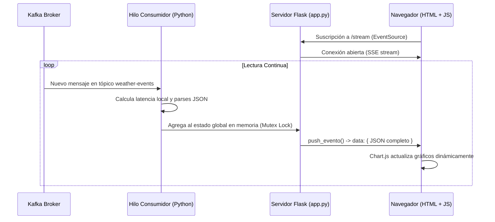

# Dashboard Web en Tiempo Real

El sistema de visualización está implementado en el script [app.py](file:///d:/Big%20data/unidad%202/weather-pipeline-juliaca/dashboard/app.py). Proporciona una interfaz web interactiva que muestra el estado actual del pipeline y las variables climáticas de Juliaca actualizándose automáticamente sin necesidad de recargar la página.

---

## 1. Arquitectura de Tiempo Real (SSE)

En lugar de realizar peticiones periódicas (polling) desde el navegador, el dashboard implementa **Server-Sent Events (SSE)**. Esta técnica establece una conexión HTTP unidireccional de larga duración que permite al servidor Flask empujar eventos en tiempo real al navegador de forma instantánea tan pronto como ocurren.

El flujo de trabajo es el siguiente:



---

## 2. Consumo Asíncrono de Kafka

Para evitar que las lecturas de red de Kafka bloqueen el servidor web de Flask, el consumo se delega a un hilo daemon que corre indefinidamente en segundo plano:

```python
threading.Thread(target=consumir_kafka, daemon=True).start()
```

Este hilo lee continuamente del broker de Kafka, procesa los eventos y almacena un buffer de los últimos 60 registros en memoria utilizando objetos eficientes **`deque`** de Python con un tamaño máximo (`maxlen=60`), lo que evita fugas de memoria por almacenamiento ilimitado.

---

## 3. Elementos Visuales del Interfaz

El frontend está estructurado en una sola plantilla HTML/CSS e incluye las siguientes secciones interactivas:

- **Indicador de Conexión**: Una insignia visual que cambia dinámicamente entre verde (`Kafka Activo`) y rojo (`Sin conexión`) dependiendo de si Flask puede comunicarse con el broker.
- **Medidores Radiales (Gauges)**: Gráficos de tipo dona implementados en Chart.js que muestran la temperatura actual (junto a la sensación térmica) y el porcentaje de humedad relativa.
- **Tarjetas de Estado (Metrics Cards)**: Resumen rápido de la velocidad del viento, presión atmosférica local (con notas aclaratorias sobre la presión típica a la altitud de Juliaca, ~3820m), número total de eventos procesados (con el offset de Kafka) y latencia del sistema.
- **Historiales de Líneas**: Dos gráficos interactivos de líneas de Chart.js que muestran el comportamiento y fluctuación de la temperatura y la presión en los últimos 40 puntos temporales guardados.
- **Mapa de Calor 24h**: Una cuadrícula con 24 celdas correspondiente a las horas del día. Cada celda se colorea de manera dinámica en base a la temperatura promedio registrada a esa hora, pasando de tonos azules (clima frío, < 8°C) a amarillos y rojos (clima cálido).
- **Log de Terminal**: Caja de texto que actúa como consola mostrando el flujo de mensajes recibidos con su respectivo timestamp, temperatura, humedad, viento y estado atmosférico general.
- **Selector de Tema Claro/Oscuro**: Botón que alterna la paleta de colores y actualiza los bordes y textos de los gráficos de Chart.js dinámicamente.
- **Simulador de Machine Learning**: Una pestaña interactiva que alberga controles (sliders de humedad, presión, viento y selectores de tiempo) conectados a la API predictiva. Permite evaluar de manera directa estimaciones térmicas en base a los modelos e incorpora gráficos dinámicos de importancia de variables calculados en caliente por Random Forest.

---

## 4. Integración y Endpoints de Machine Learning

El Dashboard inicializa en segundo plano el entrenamiento de los algoritmos de Machine Learning al arrancar. Para soportar la interacción desde el frontend, se exponen tres rutas de API dedicadas:

### A. Endpoint `/api/ml-info`
Retorna el estado de entrenamiento actual del modelo, el error absoluto medio (MAE) y el coeficiente de determinación (\(R^2\)) para ambos algoritmos, así como el número total de eventos utilizados. También expone las importancias relativas de las características calculadas por Random Forest.

### B. Endpoint `/api/predict`
Calcula y devuelve las predicciones de temperatura de forma dinámica basadas en los parámetros climáticos pasados en la URL:
`http://localhost:5000/api/predict?hora_dia=12&dia_semana=0&humedad=60&presion=630&velocidad_viento=2.0`

### C. Endpoint `/api/ml-retrain`
Forza un re-entrenamiento del modelo directamente desde la interfaz web, lo que permite al analista actualizar los coeficientes y mejorar la precisión del modelo en caliente una vez que el pipeline ha guardado nuevos datos en SQLite.
