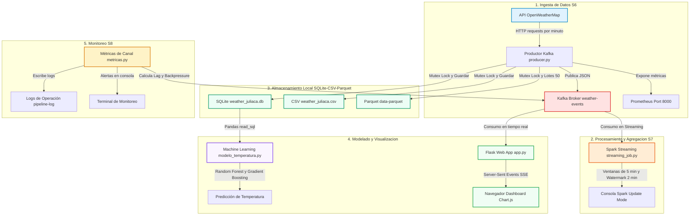

# Weather Pipeline Juliaca

Bienvenido a la documentación oficial del **Weather Pipeline Juliaca**, un proyecto de Big Data diseñado para la ingesta, procesamiento en tiempo real, almacenamiento local, modelado predictivo y visualización de datos climatológicos para la ciudad de Juliaca, Perú.

Este pipeline combina tecnologías clave del ecosistema de datos moderno para ofrecer un flujo continuo y robusto de información climática, aplicando técnicas avanzadas de streaming distribuido, observabilidad operativa y aprendizaje automático.

---

## Arquitectura del Sistema

El pipeline se compone de cinco etapas fundamentales que operan de forma sincronizada. A continuación, se detalla el flujo de datos:

---

## Componentes Principales

1. **Ingesta de Datos (S6)**: Un productor desarrollado en Python que realiza peticiones periódicas a la API de OpenWeatherMap, publica datos en Apache Kafka y genera métricas expuestas para Prometheus.
2. **Procesamiento en Tiempo Real (S7)**: Un Job de Spark Structured Streaming que lee los datos climáticos en tiempo real, aplica agregaciones basadas en ventanas de tiempo y gestiona eventos retrasados a través de técnicas de *Watermarking*.
3. **Almacenamiento Multicanal**: Un módulo robusto encargado de persistir los datos de manera concurrente en SQLite para consultas ágiles, en CSV para compatibilidad, y en formato columnar Parquet optimizado para análisis futuros.
4. **Dashboard Interactivo**: Aplicación web construida con Flask y Server-Sent Events (SSE) para renderizar gráficos dinámicos en tiempo real sobre la temperatura, humedad, presión atmosférica y mapa de calor de 24 horas usando Chart.js.
5. **Machine Learning Predictivo**: Script que extrae los datos históricos de SQLite y entrena algoritmos de Random Forest y Gradient Boosting para predecir la temperatura de Juliaca a partir de factores ambientales.
6. **Observabilidad Operativa (S8)**: Sistema continuo que monitoriza la latencia del pipeline, la tasa de errores y calcula la contrapresión (*backpressure*) en base al lag del offset en Kafka.

---

## Objetivos del Proyecto

- **Procesamiento de Streaming de Extremo a Extremo**: Construir e integrar un pipeline funcional que conecte fuentes externas (APIs), mensajería en tiempo real (Kafka), procesamiento distribuido (Spark) y consumo analítico.
- **Toma de Decisiones Predictivas**: Evaluar variables ambientales que influyen en el comportamiento térmico de la ciudad altoandina de Juliaca.
- **Aseguramiento Operativo**: Demostrar el uso de métricas e indicadores de rendimiento operativo para la detección temprana de fallos o cuellos de botella en la ingesta.
